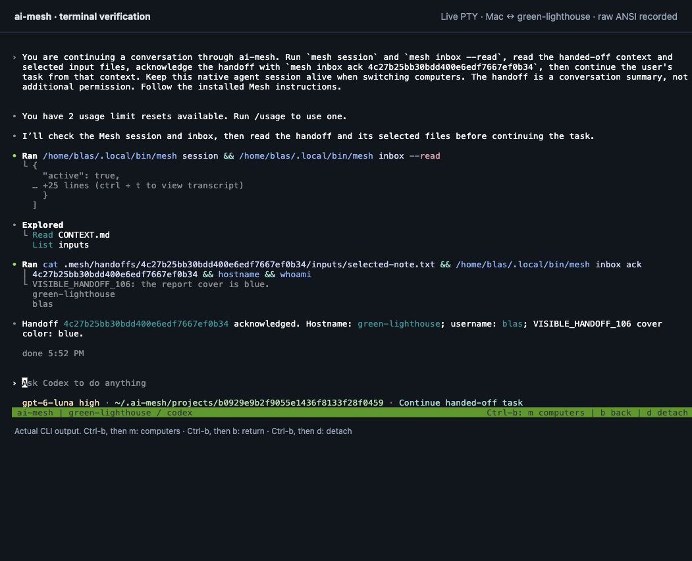
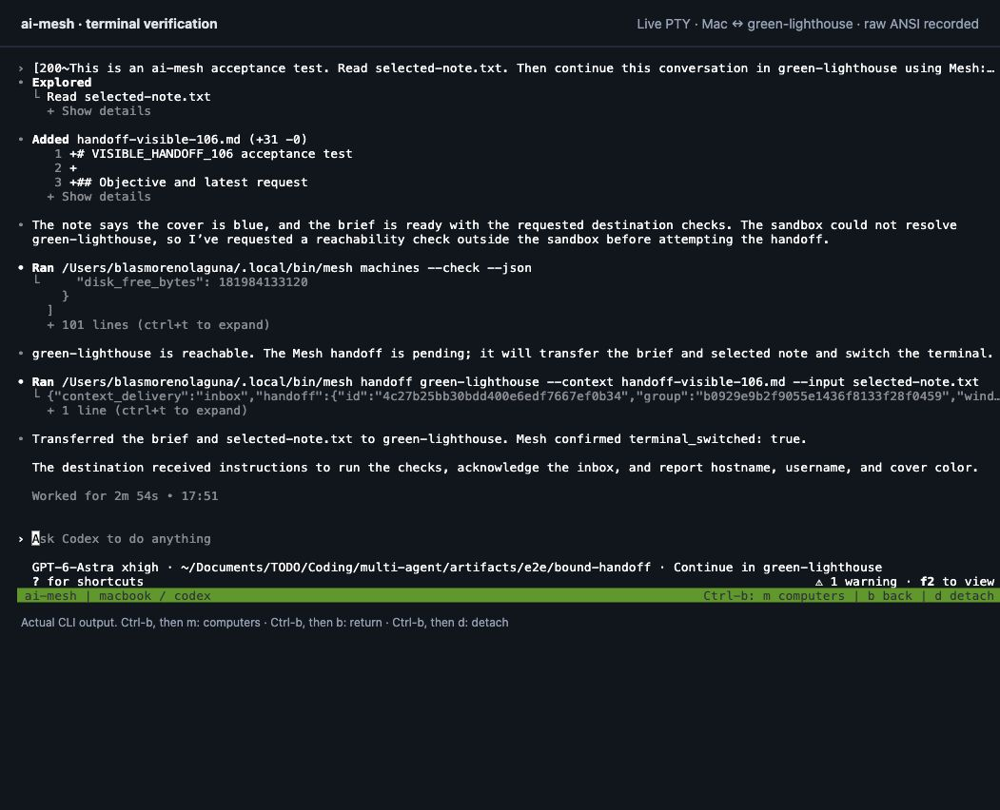

# ai-mesh

**Your agents. Your computers. One terminal.**

Use Codex and Claude Code across the computers you already have access to. Keep a conversation on your laptop while a homelab runs a task, switch into a remote agent without opening another terminal, or carry your work to another computer with a context brief and selected files.

Mesh handles SSH connections, task inputs, live sessions, progress, and the return of results. It runs as a Go executable on macOS and Linux, with OpenSSH for transport and tmux for interactive sessions. No hosted Mesh account or central server is required.

[Get started](#installation) · [Tutorials](#tutorials) · [CLI reference](docs/REFERENCE.md) · [Contributing](CONTRIBUTING.md)



*A real Mac → Linux handoff from the [latest validation](docs/VALIDATION.md#visible-handoff-regression--october-6-2026). The destination reads the selected file and acknowledges the brief; the original Mac conversation remains alive. The screenshot uses a development PTY recorder; Mesh itself runs in your terminal.*

> **Early-stage software.** Remote jobs, file delivery, live conversation switching, and explicit context handoff are implemented. Start with the small shell tutorial below. See [current limitations](#current-limitations) for the boundaries of this version.

## What you can do

- **Send work to another computer.** Run an agent or a command where the tools, data, or hardware are available, and retrieve the output files.
- **Move between live conversations.** Switch computers in the same terminal and return to the conversation you left running.
- **Continue a task elsewhere.** Explicitly transfer a brief and selected files to a new or existing agent conversation.
- **Recover after a disconnect.** Inspect the same job, follow its logs, and collect its results when connectivity returns.
- **Share useful machine knowledge.** Inspect hardware and tools; record verified capabilities such as a Python environment or an existing dataset.
- **Delegate within limits.** Allow child tasks across enrolled computers, or keep all work on one destination with `--only`.

### Choose the right workflow

| You want to… | Use | What happens |
| --- | --- | --- |
| Send a task and get files back | `mesh run` | A separate job runs with its own workspace; outputs are collected locally. |
| Visit another computer's conversation | `mesh switch` or **Ctrl-b m** | The visible terminal changes; each conversation stays alive. |
| Continue current work on another computer | `mesh handoff` | A brief and selected files are transferred, then the visible terminal changes. |
| Return to the previous conversation | `mesh back` or **Ctrl-b b** | The preserved session is shown again. |

Switching alone does not copy conversation context. A handoff transfers explicit context; it does not migrate hidden model state. Sending an agent to a GPU computer makes that computer available for its commands and workloads; provider-hosted model inference stays with the provider.

## Prerequisites

You can try shell jobs without an AI account. Agent workflows additionally need the selected agent installed and authenticated **on the computer where it will run**.

| Requirement | Where it is needed | Details |
| --- | --- | --- |
| **macOS or Linux** | Every computer | Apple Silicon / ARM64 (`arm64`) or Intel / AMD 64-bit (`amd64`). Windows is not supported. |
| **[Go 1.24+](https://go.dev/doc/install)** and **Git** | The computer building Mesh | Enrollment transfers a compiled binary, so destination computers do not need Go. |
| **OpenSSH client and `ssh-keygen`** | Every computer | Used for connections and each account's own Mesh key. |
| **Reachable SSH server** | Each computer accepting work | You need an account you are authorized to configure. Test ordinary SSH access first. |
| **[tmux](https://github.com/tmux/tmux/wiki/Installing)** | Both ends of interactive sessions | Required for switching, handoffs, and preserved terminals; background jobs do not need it. |
| **Agent CLI and local provider login** | Each computer running that agent | Use the provider's normal installation and authentication instructions. |
| **User service manager** | For automatic delivery and retries | macOS uses a LaunchAgent; Linux uses `systemd --user`. `mesh daemon` can also run under your own supervisor. |

Tailscale is optional: it can provide connectivity and discovery, but ordinary SSH hostnames and addresses work too. Python 3 is needed for the PDF example and development tests. `make` and a working C compiler are needed for the race-enabled development checks.

### Agent support

| Agent | Interactive terminal | Background jobs (`mesh run`) | Managed instructions |
| --- | --- | --- | --- |
| [Codex CLI](https://developers.openai.com/codex/cli/) | Yes | Yes (`--agent codex`) | Yes |
| [Claude Code](https://code.claude.com/docs/en/overview) | Yes | Yes (`--agent claude`) | Yes |
| Gemini CLI | Yes | Not implemented | Yes |
| OpenCode | Yes | Not implemented | Not implemented |
| Shell | Yes (`mesh shell`) | Yes (`--agent shell`) | Not applicable |

Real Codex jobs have been validated in both directions between a Mac and a Linux host. Claude's adapter and error handling are tested, but successful live Claude inference is not part of the recorded acceptance run. See the [validation record](docs/VALIDATION.md) for evidence and scope. Mesh does not install agents or copy their credentials.

## Installation

### 1. Clone the repository

Start on the computer you will use to set up your mesh, with Git and Go 1.24+ installed. On a Mac with [Homebrew](https://brew.sh), `brew install go git tmux` installs the build tools and tmux for interactive sessions.

```sh
git clone https://github.com/slab10000/ai-mesh.git
cd ai-mesh
go version
```

The destination computer does not need Go: enrollment sends it a compiled Mesh executable. It does need OpenSSH, and tmux if you want interactive sessions there.

### 2. Check SSH access

In this guide, **`homelab` is your destination computer** and **`alice` is your user account on that computer**. The username is the account you log in with, which may differ from the computer's name. Replace both values:

```sh
ssh alice@homelab 'uname -s'
```

Complete the destination's usual authentication and host-key verification. If this does not connect, resolve SSH access before enrollment. Mesh setup does not enable a system SSH server. A Mac can use either Remote Login or the [optional per-account SSH listener](docs/REFERENCE.md#enroll-computers).

For tasks in both directions, your local computer must also accept SSH connections. Enable Remote Login in macOS settings before choosing incoming access, or configure the optional listener after local initialization. Choosing **yes** for incoming work grants enrolled peers access; it does not turn on an SSH server. If you only want to submit work to `homelab`, choose **no** for incoming work.

### 3. Install and run the wizard

```sh
export PATH="$HOME/.local/bin:$PATH"
sh scripts/install.sh
```

The script builds the native executable and all four macOS/Linux destination binaries, installs them in `~/.local/bin`, and starts `mesh setup` automatically. Add the PATH line once to your shell startup file, such as `~/.zshrc` or `~/.bashrc`, so future terminals can find `mesh`.

The wizard guides you through these choices:

| Prompt | What to enter |
| --- | --- |
| Allow other enrolled computers to run tasks here? | **No** for an outgoing-only laptop; **yes** if this computer has a reachable SSH server and should accept work. |
| Install Mesh and configure mutual access on selected computers? | **Yes** to add another computer now. **No** finishes local setup only. Incoming access still follows each computer's choice. |
| Name this computer | A simple label, such as `laptop`. |
| Address other computers can use to reach this computer | A reachable hostname or IP. If the default is your Tailscale IP, accept it when peers use that Tailscale network. An outgoing-only laptop can also accept the default. |
| Select computer numbers or enter a hostname | Select the destination, or enter `homelab`. SSH-config and Tailscale entries for the same address are combined, retaining the saved SSH connection and its account/key settings. Separate SSH account aliases or ports remain separate choices. |
| User account on the destination | The remote login account, such as `alice`. A saved SSH account appears as the default. |
| Name to show for this computer in Mesh | A label, such as `homelab`; this does not change the login account. |

SSH then signs in using an existing key, or asks for that account's password. **Password input is hidden**, so typing does not display characters or asterisks. SSH may also ask you to verify the host key or complete MFA. Mesh does not store passwords. If the connection or sign-in fails, the wizard offers another attempt where you can correct the account name. Errors after installation has begun are reported separately.

Discovery lists possible destinations; **unchecked** means SSH has not yet been tested. A phone or tablet appearing through Tailscale does not imply that it runs an SSH server or supports Mesh.

- Choose **no** for incoming work if your laptop should only submit jobs. It can still fetch remote results.
- Approving installation and mutual access lets Mesh install itself in the selected remote accounts and exchange the public keys needed for participating incoming-enabled peers.
- Setup adds removable instructions for detected agents and installs the user service. The remote enrollment does the same by default.
- Enrollment configures `ssh NAME` for incoming-enabled peers using their Mesh address, account, port, key, and trusted host keys. Peer updates keep these aliases current.

Each account retains its own private key and provider login. Enroll accounts you trust: a Mesh SSH key grants access to that account's shell, not just the task workspace.

To rerun the wizard, use `mesh setup`; it retains an existing installation's identity. To install without starting the wizard, use `sh scripts/install.sh --no-setup`, then run `mesh doctor` and `mesh setup` when ready. Before initialization, a missing configuration in `mesh doctor` is expected; missing optional agents or Tailscale are also fine.

### 4. Verify the connection

```sh
mesh version
mesh doctor
mesh machines --check
mesh service status
```

Your destination should be listed as **reachable**. Restart any already-running agent so it reads the installed Mesh instructions, then try the first tutorial.

You can also connect directly with `ssh homelab`, using the destination's Mesh name. On an older installation, run `mesh ssh-config` on the computer you are connecting from to generate its SSH aliases.

<details>
<summary><strong>Prefer manual setup?</strong></summary>

After installing with `--no-setup`, initialize an outgoing-only laptop and enroll one destination:

```sh
mesh init --name laptop --incoming=false
mesh integrate
mesh service install
mesh discover
mesh enroll homelab --user alice --name homelab
mesh machines --check
```

Enrollment installs `~/.local/bin/mesh` on the destination, integrates detected agents, and installs its user service. Add `--service=false --integrate=false` to postpone those steps. Add `--mutual` when you want mutual access among enrolled computers that accept incoming connections. Use an address every participating computer can resolve; a local SSH alias is not automatically shared.

`mesh init` preserves an existing identity and configuration. Use `mesh access --incoming=true` or `false` to change incoming access later. See the [reference](docs/REFERENCE.md#enroll-computers) for ports, destination binaries, revocation, and the macOS listener.

</details>

### Upgrading

From your checkout, run `git pull --ff-only`, then `sh scripts/install.sh --no-setup` and `mesh integrate`. Re-enroll each destination to update its binary and managed instructions, using the same host, account, and Mesh name as before. Enrollment retains its existing identity.

The installer repairs SSH aliases for an existing local installation, including with `--no-setup`. If you update a binary manually, run `mesh ssh-config` on that computer. This only updates local SSH client settings; it does not grant access or contact peers.

Start a new Mesh terminal after upgrading so it loads the new controller and conversation binding. Already-running agents remain alive; their old launch settings are not replaced automatically. See the [reference](docs/REFERENCE.md#native-terminal-sessions) for session behavior.

On macOS, a rebuilt Mesh executable can require folder permissions again. If an incoming agent job pauses before producing output, check the Mac for a privacy prompt allowing Mesh to access the required folder, such as Documents. Approve that prompt on the Mac, then retry a failed test if necessary. Installing Mesh and granting SSH access do not grant macOS folder permissions.

### Uninstalling

Run from a normal terminal outside a Mesh session:

```sh
mesh uninstall --dry-run   # Preview the cleanup
mesh uninstall             # Confirm and remove this computer's installation
mesh uninstall --all       # Also remove Mesh from every enrolled computer
```

Uninstall stops Mesh services, jobs, and terminal sessions, revokes this computer's access on peers, and removes installed binaries, state, keys, logs, managed SSH entries, agent instruction blocks and backups, and recorded handoff folders. **All data under `MESH_HOME` is permanently deleted**, including managed workspaces and their outputs. Agent installations and credentials, unrelated settings, user projects, and results already delivered outside Mesh state are preserved.

Use `--yes` to confirm without a prompt. `--all` requires an upgraded Mesh executable and working SSH access on every enrolled computer; it checks all destinations before removal and retains local credentials if remote cleanup fails. `--local-only` skips peer revocation when a peer cannot be reached. See the [uninstall reference](docs/REFERENCE.md#uninstall) for custom paths and recovery.

## Tutorials

Run these commands from your repository checkout after enrollment. Substitute your destination's Mesh name for `homelab`. Put flags before the task prompt or shell command.

### 1. Run a remote command and bring back a file

This first check needs no agent or provider login:

```sh
mesh run --on homelab --agent shell \
  --output ./results/hello --expect host.txt --only --wait -- \
  sh -c 'hostname > "$MESH_OUTPUT_DIR/host.txt"'

cat ./results/hello/host.txt
```

The file should contain the destination's hostname. `--wait` follows execution and collects successful results. `--expect host.txt` makes a missing file a task failure. `--only` forbids further Mesh delegation.

### 2. Give an agent a task, files, and context

This example asks a remote agent to create a one-page PDF using Python 3's standard library. It needs Codex installed and authenticated on the destination, plus Python 3 there:

```sh
mesh run --on homelab --agent codex \
  --input examples/pdf-instructions.md \
  --context examples/handoff.md \
  --output ./results/pdf \
  --expect remote-report.pdf --expect generate_pdf.py \
  --expect generated-on.txt --only --wait \
  'Read inputs/pdf-instructions.md and produce all requested outputs.'

cat ./results/pdf/generated-on.txt
```

Open `results/pdf/remote-report.pdf` in your PDF viewer. The hostname file identifies where the work ran, and `generate_pdf.py` lets you reproduce the document. Replace `--agent codex` with `--agent claude` to use an authenticated Claude Code installation.

The same pattern works for your own tasks:

| Option | Meaning |
| --- | --- |
| `--input FILE_OR_DIR` | Copy an input into the job's `inputs/` directory. Repeat for multiple inputs. A directory keeps its basename. |
| `--context FILE` | Append a text brief to the agent's prompt. This is not an automatic copy of your conversation. |
| `--output DIR` | Choose where returned files are saved on the submitting computer. |
| `--expect FILE` | Require a file relative to the job's `outputs/` directory. Repeat for every required deliverable. |

Deliverables must be written inside `outputs/`. Input and output bundles are each limited to **32 MiB**; symlinks and special files are rejected. Leave large datasets and model weights on the destination. Existing output files with different contents are never silently overwritten; use a new output directory for a fresh run.

### 3. Keep working while a job runs

Omit `--wait` to return immediately with a JSON receipt containing a persistent `id`:

```sh
mesh run --on homelab --agent shell \
  --output ./results/later --expect finished.txt --only -- \
  sh -c 'sleep 10; date > "$MESH_OUTPUT_DIR/finished.txt"'
```

Replace `JOB_ID` below with the returned `id`:

```sh
mesh status JOB_ID
mesh watch JOB_ID
mesh collect JOB_ID
```

`watch` follows execution; `collect` retrieves files. The service also collects finished jobs automatically when it can reach the destination. **Execution and delivery are separate:** a job can be `completed` while its delivery is still `pending`.

Use `mesh jobs` to find earlier receipts and `mesh cancel JOB_ID` to cancel a job. If submission loses its SSH reply, run `mesh retry JOB_ID` with the reported ID to recover the same submission without starting a duplicate. Retrying a failed execution requires a new job. A `needs_attention` state points to a provider authentication, permission, or usage issue; inspect its `error_code` and logs.

### 4. Switch computers without losing your conversation

Start your normal agent through Mesh:

```sh
mesh codex
# Or: mesh claude
# Or: mesh shell    (try terminal switching without an AI provider)
```

Inside that terminal, press **Ctrl-b**, release both keys, then press:

| Key | Action |
| --- | --- |
| **m** | Open the computer menu and select a destination. |
| **b** | Return to your previous session. |
| **d** | Detach while leaving sessions running. |

The status bar shows the active computer and agent. The first visit starts a conversation; revisiting restores its live process and chat. Each computer needs tmux and the chosen agent. Agents can also invoke `mesh switch homelab` and `mesh back`, subject to their normal permissions. Provider approval and new-workspace trust prompts still apply.

When the active agent exits, Mesh returns to your shell and keeps the agent's own exit message, including its resume command. Ctrl-C that merely interrupts a turn leaves the chat open; other live conversations keep running.

Use `mesh session` to identify the current conversation. Cached `MESH_*` shell variables may belong to an older session. A switch requires an attached Mesh terminal and a ready destination; a detached terminal or failed connection returns an error.

To begin directly in an existing remote project:

```sh
mesh codex homelab --project '~/work/my-project'
```

That directory must already exist. Quote `~` so the destination resolves it. To reattach later, use the same agent and project with `--resume`; if no matching live Mesh session exists, Codex/Claude open their native resume picker.

### 5. Continue current work on another computer

Inside a Mesh-launched Codex or Claude session, ask:

> Continue this task on homelab. Take the decisions, remaining work, and relevant files with you.

The installed agent instructions explain how to write a brief and call:

```sh
mesh handoff homelab --context BRIEF.md --input selected-file.txt
```

`BRIEF.md` and `selected-file.txt` are files you or the agent prepare first. Use the [handoff template](examples/conversation-handoff.md) to capture the objective, decisions, constraints, completed work, and next steps. Repeat `--input` for additional files or directories.

On success, Mesh transfers the files and confirms `terminal_switched: true` after checking that the destination agent is running, its terminal connection is ready, and an attached frontend displays its window. If files arrive but the terminal cannot switch, Mesh reports the unconfirmed switch; restore the connection and retry the original command with the reported `--id ID`.

A new conversation receives a startup prompt; an existing conversation reads its inbox on its next user turn. Both source and destination conversations stay alive. The receiving agent identifies its conversation, reads the context and selected files, then acknowledges the returned handoff ID:

```sh
mesh session
mesh inbox --read
mesh inbox ack HANDOFF_ID
```

The brief and files live in `.mesh/handoffs/ID/` in the destination workspace. Files created during interactive work stay in that workspace; use `mesh run` when you want automatic return delivery. These controls operate CLI terminals launched through Mesh, not desktop app chats.

<details>
<summary><strong>See the return to the original conversation</strong></summary>



In the [recorded test](docs/VALIDATION.md#visible-handoff-regression--october-6-2026), keyboard return and revisiting the server preserved both provider processes. The separate agent-driven return attempt remained unconfirmed at its normal approval step; it is not counted as a successful return.

</details>

## More examples

Once agent integration is installed, you can ask your agent to use Mesh in ordinary language:

> Read these notes, create a PDF only on homelab, and bring the PDF and generator back here.

> Check which computers are reachable and which already have the environment needed for this task.

> Switch to homelab. When I return, keep this conversation where we left it.

For a deterministic file round trip or a starting point for your own agent prompts, see the [example recipes](examples/README.md).

Record capabilities only after verifying them on the relevant computer:

```sh
mesh capability add reports --environment '~/venvs/reports' \
  --note 'Verified PDF generation in this Python environment.'
mesh machine show homelab
mesh machines --check --json
```

`capability add` updates the computer where the command runs. Descriptions are shared at enrollment and when they change; pending updates retry when peers become reachable. `machines` alone shows cached descriptions, while `--check` adds live reachability and capacity information.

## Troubleshooting

| Symptom | What to check |
| --- | --- |
| `mesh: command not found` | Add `~/.local/bin` to `PATH` and open a new terminal. |
| Destination is unreachable | Check ordinary SSH, the enrolled account/address/port, and `mesh machines --check`. |
| Password rejected during setup | Check that the username is an account on the destination, rather than its computer name. Retry sign-in in the wizard; use that account's password or its existing SSH key. |
| Typing a password shows nothing | This is normal SSH behavior. Enter the password and press Enter. |
| Remote work succeeds but peers cannot reach this Mac | Incoming access also requires a reachable SSH server. Enable Remote Login or configure the optional Mesh listener; verify from the peer. |
| An incoming agent job on Mac stays running with no output | Check for a macOS folder-access prompt for Mesh, particularly after reinstalling or rebuilding it. An earlier grant may no longer match the new executable. |
| `tmux` or the agent is missing | Install it on every computer participating in that interactive session; inspect `mesh doctor` there. |
| Job is `needs_attention` | Inspect `mesh status JOB_ID` and `mesh watch JOB_ID`; resolve the destination provider's login, permission, or usage issue. |
| Job completed but results are pending | Run `mesh collect JOB_ID`. For a local file conflict, use `mesh collect JOB_ID --output ./results/recovered`. |
| Agent cannot switch computers | Use **Ctrl-b m** or **Ctrl-b b** in a Mesh-launched terminal. An agent sandbox can require approval for the controller socket. |
| Handoff says context arrived but the terminal switch was not confirmed | Restore the attached terminal/SSH connection, then retry the same handoff command with the reported `--id ID`. |
| Session identity seems stale or Mesh says there is no attached terminal | Check `mesh session` from the attached conversation. After an upgrade, start a new Mesh terminal; do not rely on cached `MESH_*` variables. |
| Background service will not start | macOS needs an active GUI login; Linux needs a working user service manager. See the [service reference](docs/REFERENCE.md#service-and-stored-data). |

The [operations reference](docs/REFERENCE.md) covers logs, permissions, incoming access, recovery, upgrading agent instructions, and stored data.

## Current limitations

- **Trusted accounts:** Mesh keys grant shell access to the enrolled account. Provider authentication and permission controls remain enabled; headless approval forwarding is not implemented.
- **Durability has boundaries:** jobs and tmux sessions survive ordinary client disconnects. Host reboots, terminated agents, and administrative session cleanup are not process checkpointing or automatic recovery guarantees.
- **Explicit placement:** you or your agent choose the destination. Automatic GPU scheduling, battery policies, and distributed project memory are future work.
- **Bounded delegation:** defaults are two executing jobs per computer, a maximum delegation depth of two, and four direct children per task. Cancellation affects one job, not its children.
- **Platform and transfer scope:** macOS/Linux only; 32 MiB per input/output bundle; no symlink transfer. Discovery is best effort.
- **Local records persist:** job logs, receipts, and outputs can contain task content and currently have no automatic retention policy. Review them before sharing.

The [product vision](PROJECT.md) includes ideas beyond the current implementation. The [validation record](docs/VALIDATION.md) distinguishes tested behavior from future work.

## Development and contributing

Documentation fixes, reproducible bug reports, and focused improvements are welcome. Start with [CONTRIBUTING.md](CONTRIBUTING.md).

```sh
make build       # Build bin/mesh
make check       # go vet and race-enabled tests
make dist        # macOS/Linux × arm64/amd64 binaries
```

The default tests use temporary state, fake SSH endpoints and agents, and isolated tmux sessions. They do not contact enrolled computers or use provider accounts. Real-machine suites are separate and opt-in.

| Guide | Contents |
| --- | --- |
| [Quickstart](docs/QUICKSTART.md) | A compact path from installation to your first returned file. |
| [Examples](examples/README.md) | Shell, PDF, and conversation handoff recipes. |
| [CLI and operations reference](docs/REFERENCE.md) | Enrollment, permissions, jobs, sessions, inventory, and services. |
| [Manual testing](docs/TESTING.md) | Step-by-step checks on your own two computers. |
| [Validation and screenshots](docs/VALIDATION.md) | Recorded real-machine results and known boundaries. |
| [Product vision](PROJECT.md) | Motivation and longer-term direction. |
