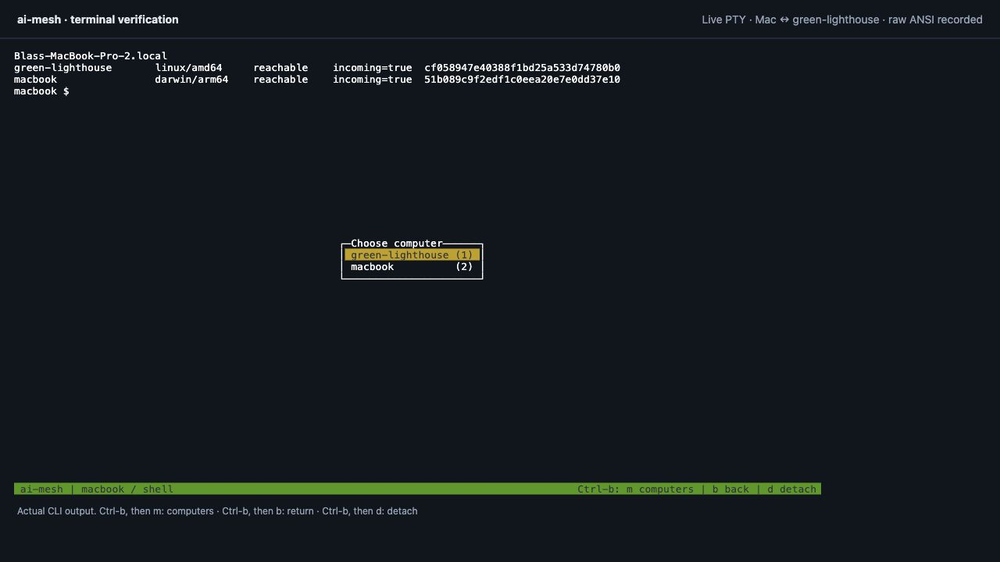
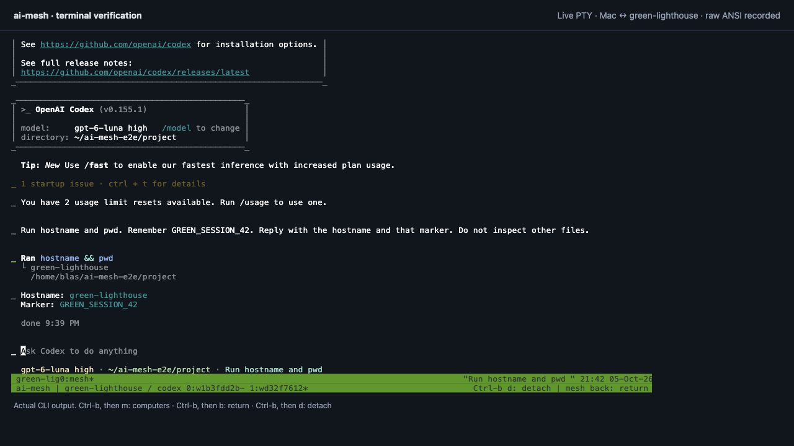
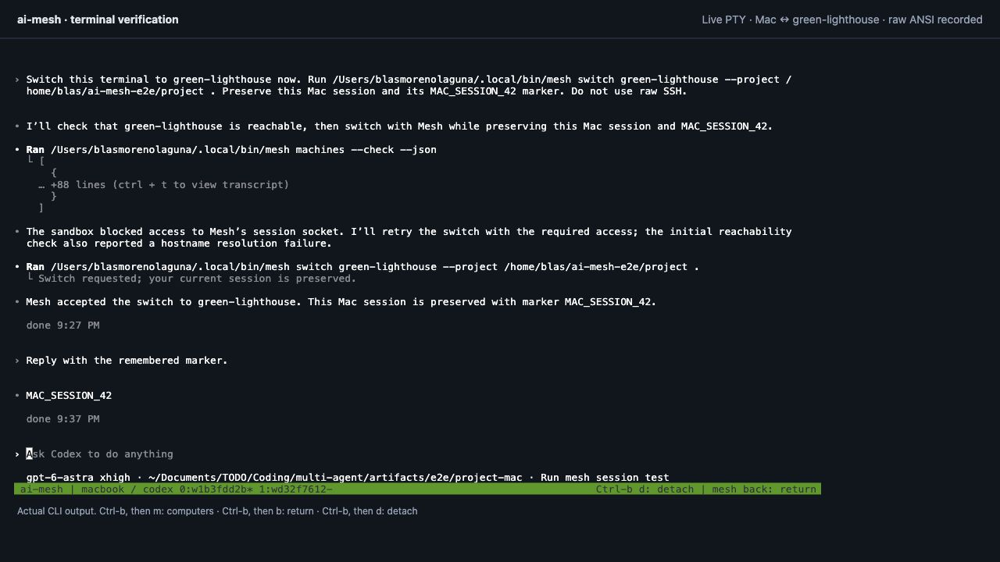
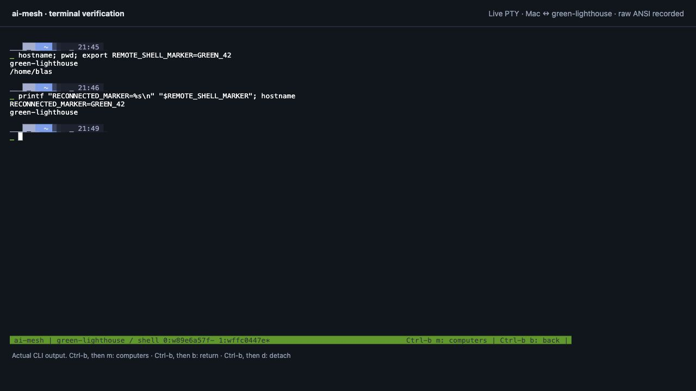
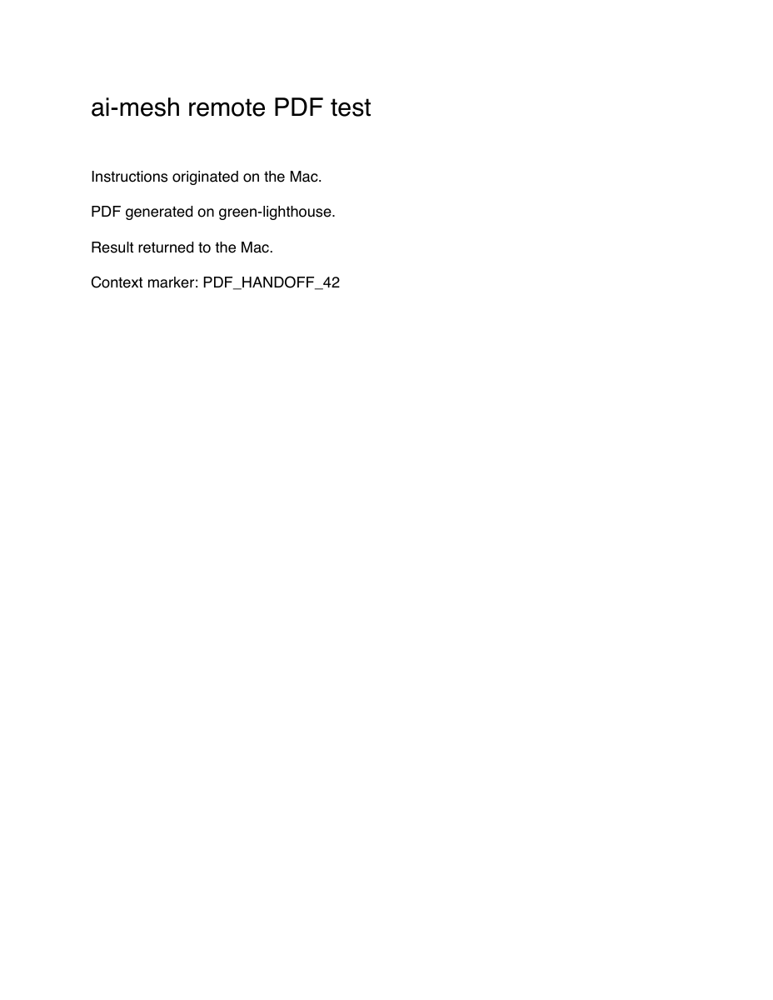

# Real-machine validation

Tested on October 5, 2026, America/Chicago (UTC report timestamps are October 6). This records actual work on the Mac and `blas@green-lighthouse`, in addition to the isolated Go tests.

## Result

**15/15 final acceptance scenarios passed: 13 command workflows plus real Codex in both directions.** Real remote Codex input/context handoff and PDF generation passed. Native Codex and shell switching, return, session preservation, detach/resume, and SSH reconnection were exercised. Real reverse Codex delegation (server → Mac → server → Mac) also passed after the user enabled Full Disk Access for Mesh. Codex is the requested provider; Claude is optional and outside the final acceptance scope.

The machine-readable [results.json](evidence/results.json) contains persistent job IDs and outcomes. The first harness run incorrectly used `peer` instead of `machine` when reading inventory JSON; that assertion was corrected, then the final complete command suite passed. No failed product check has been relabeled as a pass.

## What was tested

| Scenario | Result / evidence |
| --- | --- |
| Tailscale discovery before choosing a destination | Server found; Tailscale Funnel ingress infrastructure filtered out |
| Enrollment and repeated upgrades | Same machine IDs retained; platform binaries installed atomically; native sessions remained alive |
| Passwordless access and live inventory | Both computers reachable with incoming access; dedicated Mesh keys and checked host keys |
| Files with spaces, apostrophes, Unicode and shell metacharacters | Exact bytes returned, SHA-256 recorded |
| Raw progress traces | Live command marker observed through `mesh watch` |
| Execution versus delivery | Observed `completed` + `pending`, then `delivered` after collection |
| Automatic delivery recovery | Job finished while the Mac service was stopped; starting the service retrieved it without `collect` |
| Reverse work and nested delegation | Server parent → Mac child → server parent → originating Mac; returned hostname proved child placement |
| Strict placement | A `--only` task's attempted child delegation was rejected |
| Cancellation and ordinary command failure | Long-running command cancelled; explicit failure preserved exit code 23 |
| Missing deliverable | Exit code 0 did not count as completion when `--expect report.pdf` was unmet |
| Existing local file conflict | Existing bytes preserved; delivery stayed pending; collecting to a new directory succeeded |
| Concurrent jobs and scheduler | Four simultaneous submissions completed under the server's two-job execution limit |
| Lost submit reply | A test wrapper executed real SSH then discarded its submit reply; retrying the same ID produced exactly one execution |
| Shared capabilities | Unique test capability added on server, synchronized to Mac, removed, and removal synchronized. The verified PDF capability was then recorded for future agent use. |
| Real Codex context handoff | Input instructions and separate context marker both appeared in the returned file |
| Real reverse Codex | Server submitted a Codex child on Mac; its exact output marker returned through the server to the origin |
| Optional Claude error handling | Expired OAuth detected even though a provider event had `subtype: success`; no false completion |
| Remote PDF workflow | Codex generated a valid one-page PDF on green-lighthouse, returned the generator and host evidence; rendered and visually checked on Mac |
| Native Codex | Ran hostname/pwd on Mac and server; Mac's original `MAC_SESSION_42` conversation marker remained available after return |
| Computer picker and keyboard return | Ctrl-b m selected the server; Ctrl-b b returned, independent of provider sandbox permissions |
| Broken interactive SSH connection | Terminated only the test SSH client; selected the destination again; same remote shell retained `GREEN_42` |
| Agent integration | Managed instruction blocks installed on detected agents while preserving surrounding files |

Default verification: `go vet ./...` and the complete race-enabled Go suite passed. The full race suite includes service dispatch: peer submissions use the running service environment; local CLI submissions retain their caller environment. The tests cover path traversal, symlinks, hashes, concurrent writers/collectors, inventory revisions, credentials/permission flag handling, access changes/revocation, scheduling, idempotency, and session control authentication. Revocation and offline-host recovery cases use isolated fixtures; we did not remove your real machines or power them off.

## Screenshots

These are browser screenshots of a **real PTY running the installed Mesh/native agent commands**, rendered by xterm.js. They are not mock terminal images. `scripts/terminal_lab.py` is a loopback-only development recorder; it is not part of the product or a new Mesh web service. Raw ANSI recordings remain locally under `artifacts/e2e/` and are excluded from Git. The regular native Terminal app was unavailable to the screenshot automation.

### Computer picker

### Remote native Codex

### Preserved conversation on the Mac

### Connection recovery

### Generated PDF

The original returned [PDF](evidence/remote-report.pdf), [generator](evidence/generate_pdf.py), and [host evidence](evidence/generated-on.txt) are preserved. This is a simple acceptance-test document, not a product UI mockup.

## Fixes driven by these tests

- Discover agent executables in mise shims and NVM, including from minimal SSH environments. Preserve an explicit user PATH ahead of fallbacks.
- Dispatch peer jobs through the installed service when available; preserve local CLI execution context. Retry transient launchd upgrade races.
- Ignore Tailscale ingress infrastructure when listing candidate computers.
- Atomically replace installed binaries so upgrades do not disrupt running sessions.
- Restart an existing Linux Mesh service during upgrade so it runs the new binary.
- Report provider authentication, permission, and usage errors as actionable states; require named outputs when requested.
- Add a direct computer menu and return shortcut, a shell launcher, readable machine labels, UTF-8 terminal output, and reconnect exited SSH panes.
- Provide an explicit macOS user SSH listener for a Mac whose system SSH server is off. It binds only to a selected private IP, checks its own host key, and accepts enrolled Mesh keys only.

## Boundaries and remaining work

- The user selected Codex. An earlier optional Claude probe encountered expired OAuth and correctly reported `needs_attention`; successful Claude inference is not claimed and no Claude setup is required. A login-status response alone proved insufficient to establish readiness.
- Background Codex on Mac initially stalled during directory access. macOS TCC logs showed Full Disk Access denied for Mesh. After the user granted that permission, the same reverse workflow passed. No provider permission bypass was added.
- Native agent permissions remain enabled. Remote Codex's natural-language `mesh back` attempt could not obtain socket access in its sandbox; the keyboard return succeeded. We did not disable protections or install bypass flags.
- Automatic agent-driven placement, training/battery rules, API-based approval forwarding, Windows, desktop chat migration, and distributed memory replication remain future work. Nested command delegation works; autonomous AI planning across many machines was not validated.
- Tests used two computers. No third-machine mesh, host reboot, actual power loss, large-model training, or performance scaling claim is made. Transfer bundles remain limited to 32 MiB.
- The Mac's user services require a logged-in GUI session. Server user lingering is off. tmux and durable job records handle ordinary client disconnection, not every operating-system shutdown policy.
- Test jobs/results and preserved tmux sessions remain available for inspection. Generated live-test files are in the ignored `artifacts/e2e/` directory and each computer's Mesh job store. No provider credentials are included in the evidence.

Start with the [short usage guide](QUICKSTART.md), or follow the longer [manual checklist](TESTING.md).
