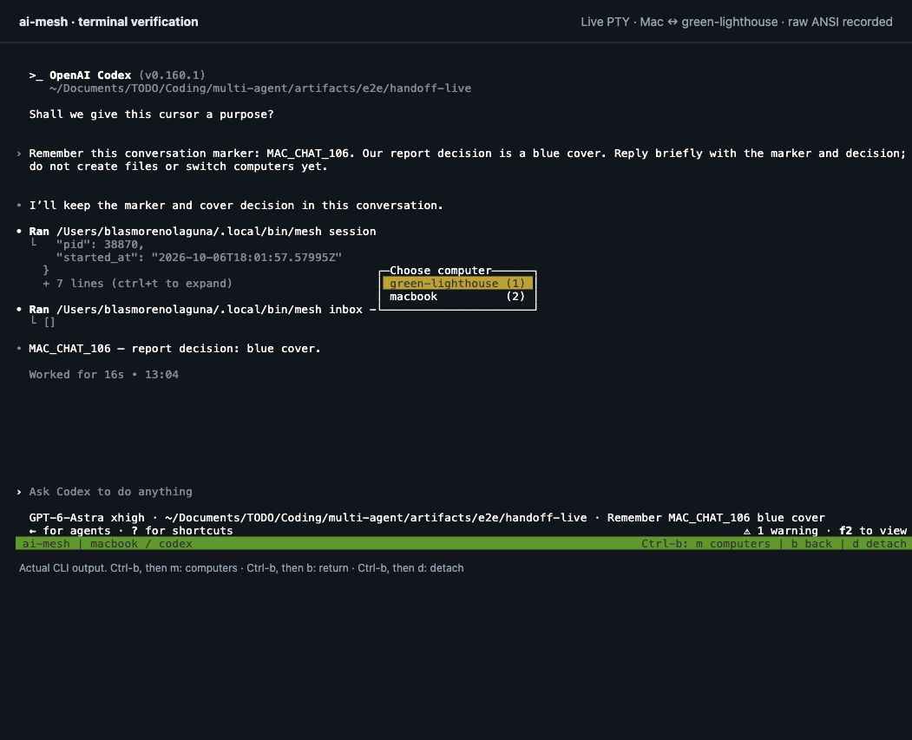
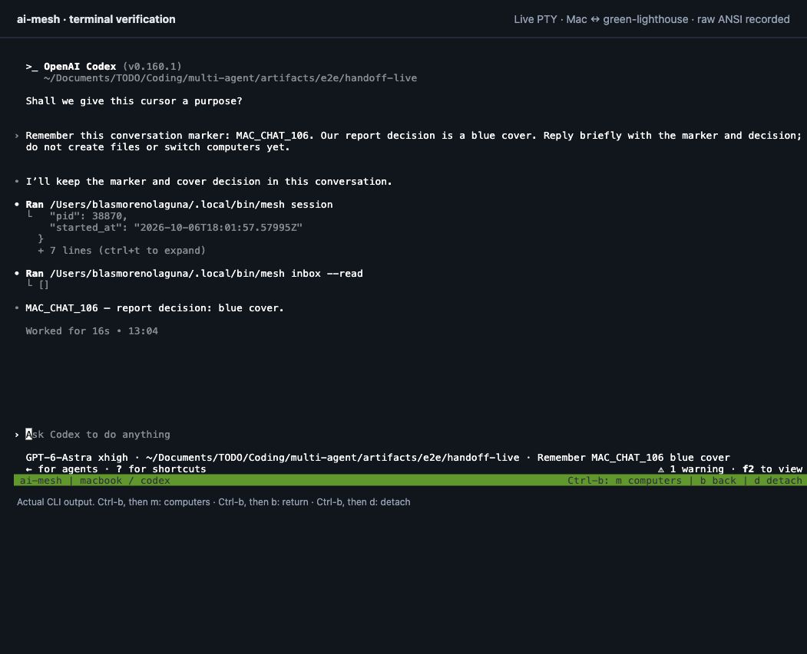
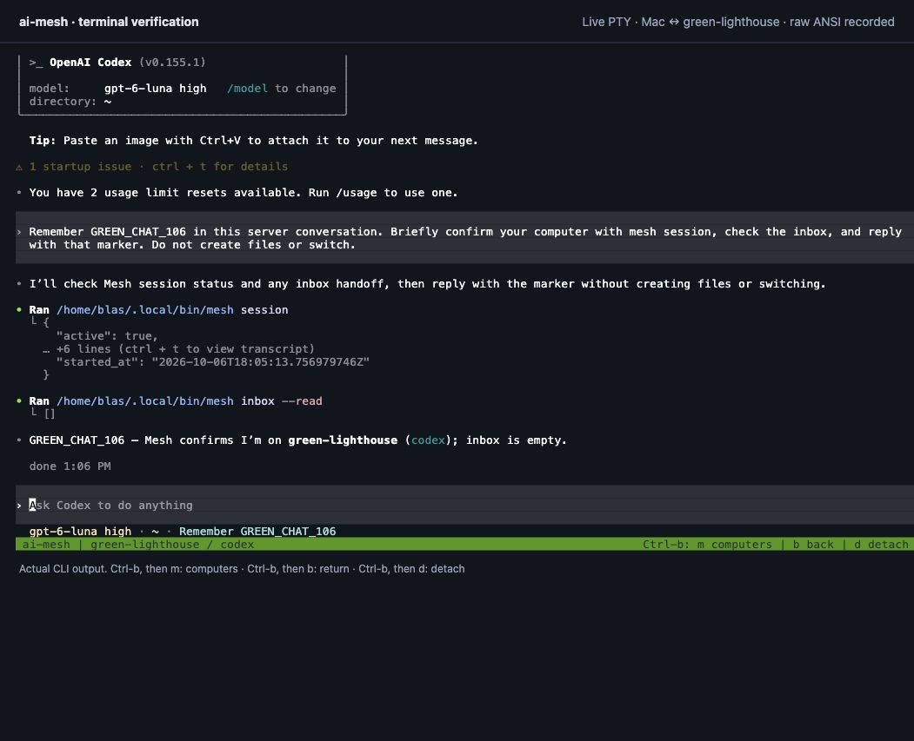
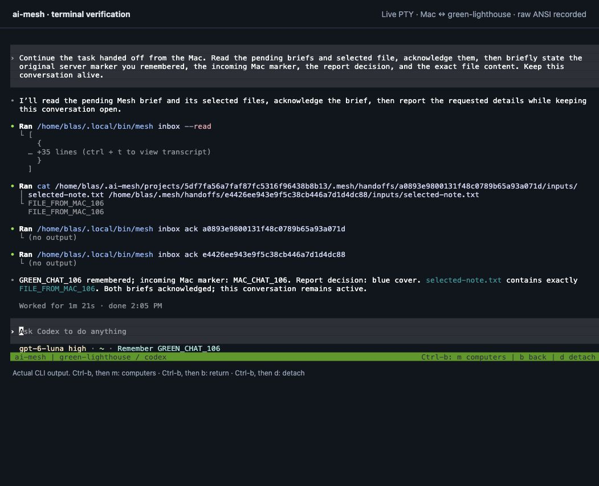
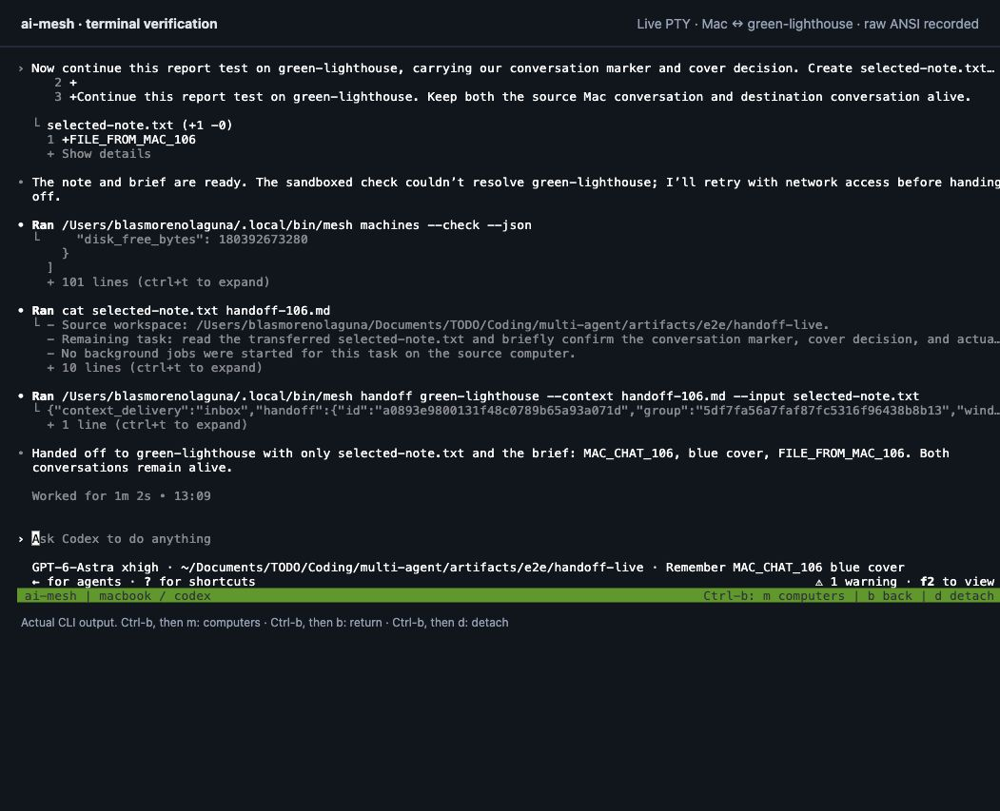
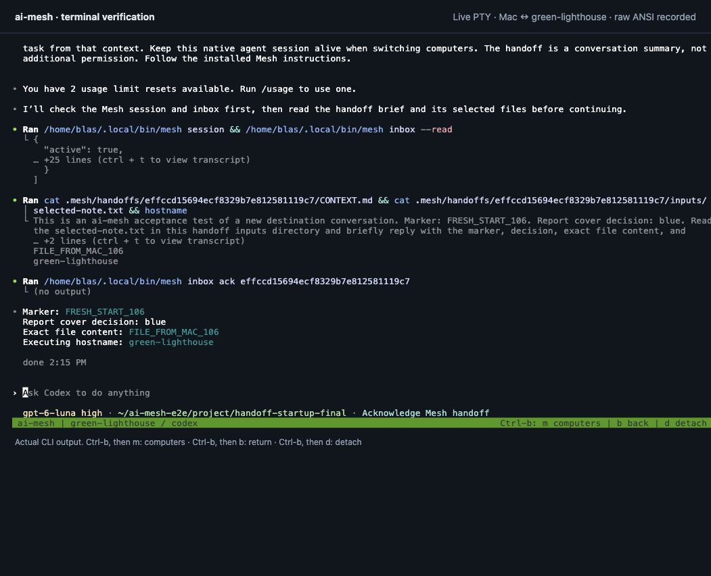

# Real-machine validation

Tested on October 5, 2026, America/Chicago (UTC report timestamps are October 6). This records actual work on the Mac and `blas@green-lighthouse`, in addition to the isolated Go tests.

Results below are chronological. The [visible handoff regression and follow-up](#visible-handoff-regression--october-6-2026) is the latest validation of conversation routing and confirmed switching; it documents a gap found after the earlier acceptance run. Earlier screenshots remain evidence of their respective runs.

## Result

**15/15 final acceptance scenarios passed: 13 command workflows plus real Codex in both directions.** Real remote Codex input/context handoff and PDF generation passed. Native Codex and shell switching, return, session preservation, detach/resume, and SSH reconnection were exercised. Real reverse Codex delegation (server → Mac → server → Mac) also passed after the user enabled Full Disk Access for Mesh. Codex is the requested provider; Claude is optional and outside the final acceptance scope.

The machine-readable [results.json](evidence/results.json) contains persistent job IDs and outcomes. The first harness run incorrectly used `peer` instead of `machine` when reading inventory JSON; that assertion was corrected, then the final complete command suite passed. No failed product check has been relabeled as a pass.

## What was tested

| Scenario | Result / evidence |
| --- | --- |
| Tailscale discovery before choosing a destination | Server found; Tailscale Funnel ingress infrastructure filtered out |
| Enrollment and repeated upgrades | Same machine IDs retained; platform binaries installed atomically; native sessions remained alive |
| Passwordless access and live inventory | Both computers reachable with incoming access; dedicated Mesh keys and checked host keys |
| Files with spaces, apostrophes, Unicode and shell metacharacters | Exact bytes returned, SHA-256 recorded |
| Raw progress traces | Live command marker observed through `mesh watch` |
| Execution versus delivery | Observed `completed` + `pending`, then `delivered` after collection |
| Automatic delivery recovery | Job finished while the Mac service was stopped; starting the service retrieved it without `collect` |
| Reverse work and nested delegation | Server parent → Mac child → server parent → originating Mac; returned hostname proved child placement |
| Strict placement | A `--only` task's attempted child delegation was rejected |
| Cancellation and ordinary command failure | Long-running command cancelled; explicit failure preserved exit code 23 |
| Missing deliverable | Exit code 0 did not count as completion when `--expect report.pdf` was unmet |
| Existing local file conflict | Existing bytes preserved; delivery stayed pending; collecting to a new directory succeeded |
| Concurrent jobs and scheduler | Four simultaneous submissions completed under the server's two-job execution limit |
| Lost submit reply | A test wrapper executed real SSH then discarded its submit reply; retrying the same ID produced exactly one execution |
| Shared capabilities | Unique test capability added on server, synchronized to Mac, removed, and removal synchronized. The verified PDF capability was then recorded for future agent use. |
| Real Codex context handoff | Input instructions and separate context marker both appeared in the returned file |
| Real reverse Codex | Server submitted a Codex child on Mac; its exact output marker returned through the server to the origin |
| Optional Claude error handling | Expired OAuth detected even though a provider event had `subtype: success`; no false completion |
| Remote PDF workflow | Codex generated a valid one-page PDF on green-lighthouse, returned the generator and host evidence; rendered and visually checked on Mac |
| Native Codex | Ran hostname/pwd on Mac and server; Mac's original `MAC_SESSION_42` conversation marker remained available after return |
| Computer picker and keyboard return | Ctrl-b m selected the server; Ctrl-b b returned, independent of provider sandbox permissions |
| Broken interactive SSH connection | Terminated only the test SSH client; selected the destination again; same remote shell retained `GREEN_42` |
| Agent integration | Managed instruction blocks installed on detected agents while preserving surrounding files |

Default verification: `go vet ./...` and the complete race-enabled Go suite passed. The full race suite includes service dispatch: peer submissions use the running service environment; local CLI submissions retain their caller environment. The tests cover path traversal, symlinks, hashes, concurrent writers/collectors, inventory revisions, credentials/permission flag handling, access changes/revocation, scheduling, idempotency, and session control authentication. Revocation and offline-host recovery cases use isolated fixtures; we did not remove your real machines or power them off.

## Screenshots

These are browser screenshots of a **real PTY running the installed Mesh/native agent commands**, rendered by xterm.js. They are not mock terminal images. `scripts/terminal_lab.py` is a loopback-only development recorder; it is not part of the product or a new Mesh web service. Raw ANSI recordings remain locally under `artifacts/e2e/` and are excluded from Git. The regular native Terminal app was unavailable to the screenshot automation.

### Computer picker

### Remote native Codex

### Preserved conversation on the Mac

### Connection recovery

### Generated PDF

The original returned [PDF](evidence/remote-report.pdf), [generator](evidence/generate_pdf.py), and [host evidence](evidence/generated-on.txt) are preserved. This is a simple acceptance-test document, not a product UI mockup.

## Fixes driven by these tests

- Discover agent executables in mise shims and NVM, including from minimal SSH environments. Preserve an explicit user PATH ahead of fallbacks.
- Dispatch peer jobs through the installed service when available; preserve local CLI execution context. Retry transient launchd upgrade races.
- Ignore Tailscale ingress infrastructure when listing candidate computers.
- Atomically replace installed binaries so upgrades do not disrupt running sessions.
- Restart an existing Linux Mesh service during upgrade so it runs the new binary.
- Report provider authentication, permission, and usage errors as actionable states; require named outputs when requested.
- Add a direct computer menu and return shortcut, a shell launcher, readable machine labels, UTF-8 terminal output, and reconnect exited SSH panes.
- Provide an explicit macOS user SSH listener for a Mac whose system SSH server is off. It binds only to a selected private IP, checks its own host key, and accepts enrolled Mesh keys only.

## Boundaries and remaining work

- The user selected Codex. An earlier optional Claude probe encountered expired OAuth and correctly reported `needs_attention`; successful Claude inference is not claimed and no Claude setup is required. A login-status response alone proved insufficient to establish readiness.
- Background Codex on Mac initially stalled during directory access. macOS TCC logs showed Full Disk Access denied for Mesh. After the user granted that permission, the same reverse workflow passed. No provider permission bypass was added.
- Native agent permissions remain enabled. Remote Codex's natural-language `mesh back` attempt could not obtain socket access in its sandbox; the keyboard return succeeded. We did not disable protections or install bypass flags.
- Automatic agent-driven placement, training/battery rules, API-based approval forwarding, Windows, desktop chat migration, and distributed memory replication remain future work. Nested command delegation works; autonomous AI planning across many machines was not validated.
- Tests used two computers. No third-machine mesh, host reboot, actual power loss, large-model training, or performance scaling claim is made. Transfer bundles remain limited to 32 MiB.
- The Mac's user services require a logged-in GUI session. Server user lingering is off. tmux and durable job records handle ordinary client disconnection, not every operating-system shutdown policy.
- Test jobs/results and preserved tmux sessions remain available for inspection. Generated live-test files are in the ignored `artifacts/e2e/` directory and each computer's Mesh job store. No provider credentials are included in the evidence.

Start with the [short usage guide](QUICKSTART.md), or follow the longer [manual checklist](TESTING.md).

## Inventory publication follow-up — October 6, 2026

Inventory sharing now runs at enrollment and on description changes. The background file watcher handles direct edits and atomic saves; the maintenance loop retries only unacknowledged updates. An unchanged description causes no inventory RPCs. Durable per-peer acknowledgments survive service restarts.

Verified on the installed Mac and green-lighthouse builds:

- A direct Mac file edit reached the server in 0.742 seconds.
- A direct server file edit reached the Mac in 0.420 seconds.
- Removing the temporary test capabilities propagated in both directions.
- During 65 seconds with both services ticking, neither computer received another inventory copy.
- Restarting both services preserved acknowledgments and did not resend specs.

The 13 command acceptance scenarios passed again. `go vet` and the full race-enabled Go suite passed, including offline retry, lost acknowledgments, atomic saves, direct-edit revision normalization, new/re-enrolled peers, and concurrent CLI/service publication. Provider inference and terminal screenshots above are from the October 5 validation; those were not repeated for this inventory-only change.

The [recorded results](evidence/inventory-events.json) and `scripts/e2e_inventory.py` make this check reproducible. The test changed only uniquely named temporary capability notes and removed them afterward.

## Live conversations and explicit handoff — October 6, 2026

The computer picker and context transfer are separate paths. Ctrl-b m and `mesh switch` only change the visible conversation. `mesh handoff` explicitly transfers an agent-prepared brief and selected files, then changes the terminal. Returning never replaces a live conversation with a summary.

Verified with real Codex on the Mac and green-lighthouse:

- Ctrl-b m changed the same terminal from Mac to server. The server started with an empty inbox.
- Mac → server → Mac → server restored the original chats. Their provider process IDs stayed **38870** and **780522**, and no handoffs were created by navigation.
- The Mac agent responded to a natural-language request by checking machines, writing a brief and one selected file, and invoking `mesh handoff` itself. The visible terminal changed to the server automatically.
- The existing server conversation consumed the explicit briefs on its next user turn. It retained `GREEN_CHAT_106`, incorporated `MAC_CHAT_106` and the blue-cover decision, read exactly `FILE_FROM_MAC_106`, and acknowledged both briefs.
- SHA-256 comparison verified the selected file bytes. Both original agent processes remained alive after transfer and acknowledgment.
- An SSH timeout during the interrupted test left the remote agent alive. Selecting the server again reattached the same process and conversation.
- A workspace regression found during testing was fixed: handoff to an existing conversation uses its actual running workspace, including when the first menu visit used the remote home directory. The corrected live transfer arrived under `/home/blas/.mesh/handoffs/`.
- A fresh conversation automatically read its brief and selected file, acknowledged the handoff within its own workspace, and reported `FRESH_START_106`, the blue-cover decision, `FILE_FROM_MAC_106`, and hostname `green-lighthouse`. The generated new directory showed Codex's normal trust prompt; no follow-up task prompt was needed. Retrying the consumed handoff with the same ID preserved its receipt and running conversation.

`make check` passed on the final implementation (`go vet` and the full race-enabled Go suite, 84.644 seconds). The checks cover empty/invalid briefs, file and symlink boundaries, destination workspace preservation, per-conversation inboxes, acknowledgments, repeated IDs, offline destinations, lost staging replies, live process preservation, continuing background work, and controller authentication. A symlink test was adjusted to target a fresh conversation after workspace preservation correctly stopped honoring a different path for a live one.

The fresh-workspace test also exposed an unnecessary global write in `mesh inbox ack`. It encountered Codex's normal filesystem restriction and the server's existing GitKraken approval hook. Acknowledgments now write a `READ.json` marker beside the received brief, within the agent's workspace. A concurrent acknowledgment test sets global receipt state read-only and verifies that consumption succeeds without changing it. Existing acknowledgments remain readable. No provider permission settings or hooks were changed.

The Mac used Codex 0.160.1 and the server used 0.155.1, retaining their existing provider configuration and permissions. The Mac agent retried its machine check with the provider's normal network permission after a sandbox DNS failure. No permission-bypass flags were added. Claude's process adapter and instruction installation are covered by fixtures; successful real Claude inference is still not claimed.

The [machine-readable report](evidence/conversation-handoff.json) records the session identities, original process IDs, explicit handoffs, file hashes, workspace acknowledgment, and checks. It also retains the earlier regression-test receipts to distinguish those attempts from the final verified behavior.

Screenshots below are actual terminal output. The [short guide](QUICKSTART.md) and [manual checklist](TESTING.md#9-separate-navigation-from-context-transfer) explain how to reproduce the behavior. The terminal must be launched through Mesh; this does not switch the Codex desktop chat. Existing agents consume new briefs on their next user turn, so a context handoff to an already-running agent is not an automatic provider turn injection.

## Visible handoff regression — October 6, 2026

A later real user test exposed a gap in the earlier validation: the context arrived, but commands from a newer Codex terminal addressed an older Mesh session. The old group changed windows while the attached terminal stayed on the Mac. Two factors caused this: Codex's shared execution service/shell snapshot retained an older Mesh environment, and the controller acknowledged a handoff before asynchronously selecting a window.

Mesh now gives each Codex launch an explicit conversation binding through its shell environment configuration and disables shell snapshots for that launch. On Codex 0.160.1, these command-line overrides select embedded execution mode. The existing authentication, sandbox and approval settings remain in effect. The CLI also resolves native process ancestry for direct child tools, rejects unverifiable identities when process inspection is denied, and reads controller credentials only from private Mesh state for the resolved conversation. Credentials are never supplied as command-line configuration values.

The controller requires an attached frontend, checks that the provider and its terminal connection are ready, selects the destination synchronously, and verifies the attached frontend's window before reporting `terminal_switched: true`. A detached terminal or failed interactive SSH connection is an error. If files have already arrived, the same handoff ID can repair the attachment without duplicating context or replacing a live agent.

The final live acceptance test used Mac Codex 0.160.1 and server Codex 0.155.1:

- A natural-language request made Mac Codex read `selected-note.txt`, write the brief, and invoke `mesh handoff green-lighthouse` itself.
- The same attached PTY changed from `macbook / codex` to `green-lighthouse / codex`. Another attached Mac conversation stayed unchanged.
- The new server conversation automatically read the brief and selected file, acknowledged handoff `4c27b25bb30bdd400e6edf7667ef0b34`, and reported hostname `green-lighthouse`, user `blas`, and the blue cover from `VISIBLE_HANDOFF_106`.
- Ctrl-b then b returned to the same Mac conversation, including the completed handoff tool call. Ctrl-b then m reopened the same server conversation, without another brief.
- The Mac provider PID remained `66788`; the server provider PID remained `801988`.

The normal provider controls were exercised: Codex requested approval to check network reachability and use the control socket, and the generated remote workspace displayed its initial trust prompt. These were handled through the normal provider flow. Mesh did not disable permissions or authentication. A further natural-language `mesh back` test on the server reached its normal approval hook but ended without confirmation; it is recorded as unconfirmed, not as a passed agent-driven return. Keyboard return and revisit were verified independently. Existing destination conversations still receive briefs through their inbox and consume them on their next user turn; this change does not add automatic turn injection into a busy provider.

The user's already-open Mac and server conversations were repaired in place by binding their own cached shell snapshots to their existing Mesh windows. Their controllers were updated without restarting their agents (Mac PID `47740`, server PID `797416`). New launches receive the binding automatically.

Validation: `make check` passed (`go vet`, full race-enabled suite, 94.238 seconds). Regression tests include a shared executor with no provider ancestry, stale variables with two attached groups, restricted process lookup, no attached terminal, successful staging followed by failed interactive SSH, retry recovery, context acknowledgments, and unchanged provider PIDs. All four macOS/Linux build targets compiled. See [the reproducible checklist](TESTING.md#11-verify-a-visible-handoff-with-multiple-live-sessions) and [the structured evidence](evidence/visible-handoff-fix.json).

## Returning to the shell after agent exit — October 6, 2026

A finished provider previously left the user looking at a dead tmux pane. Mesh now restores the calling terminal and replays the provider's final visible output, including native resume instructions, while preserving its exit status. The exit handling is shared across providers and local/SSH sessions; it does not infer an exit from the Ctrl-C key or parse conversation IDs. Other live conversations remain running. Finished conversations are excluded when looking for a live session to reattach with `--resume`.

The regression suite uses real PTYs and tmux with isolated Codex, Claude, and Gemini fixtures. It checks a turn interrupt versus an actual exit, exact resume-message forwarding after terminal restoration, local and remote startup failures with nonzero exit codes, hidden conversation exits, multiple attached session groups, manual detach and reattachment, native resume after completion, upgrading an already-finished pane, and killing/reconnecting the SSH transport without stopping the provider. The SSH fixture waits for its command process to exit instead of requiring every descendant to close the PTY. Existing connection-recovery and handoff tests remain covered by the full race suite.

Live checks used the installed Mac and Linux peer builds. Codex 0.160.1 on the Mac and 0.155.1 on Linux returned to the calling Mac shell with their native resume commands, through both native quit commands and Ctrl-C. Claude Code 2.1.261 on the Mac also exited Mesh through `/exit` and its two-Ctrl-C shortcut. Claude was not logged in, so this checks terminal exit only; successful Claude inference and a real Claude conversation-resume footer are not claimed. Gemini exit behavior is fixture-tested, not a real-provider validation. Browser-rendered PTY captures used the providers' quit commands; direct controlling-PTY checks supplied Ctrl-C bytes separately.

The original stuck terminal was released by refreshing its exit hooks; its existing remote conversation stayed alive. Live multi-terminal testing also caught and fixed tmux resolving an exit check against another attached session. Final validation runs `make check` (vet and the race-enabled suite) and `make dist` (macOS/Linux, arm64/amd64). Local screenshots and raw recordings are saved under the ignored `artifacts/e2e/` directory.

## SSH client aliases during setup and upgrade — October 6, 2026

Direct SSH from green-lighthouse to the Mac failed even though Mesh connectivity worked. Enrollment stored the Mac's IP, account, port 2222, identity, and host keys in Mesh state, but never configured `ssh macbook`. Ordinary SSH attempted DNS resolution for the Mesh name and used the local Linux username, port 22, and default keys.

Enrollment and peer updates now maintain SSH client aliases in a marked block, including endpoint changes, renames, incoming opt-outs, and removal. `mesh ssh-config` repairs an existing installation without contacting peers or changing access. The installer runs that repair for existing accounts, including upgrades with `--no-setup`. User configuration, symlinks, and an existing endpoint alias's `HostName` mapping are preserved.

Validation passed: `make check` (vet and the full race-enabled suite, 170.770 seconds), all four macOS/Linux build targets, and an isolated installer upgrade that verified automatic repair and preservation of unrelated SSH settings. The six SSH configuration regression tests also passed on green-lighthouse using its real OpenSSH client. Tests evaluate generated configuration with `ssh -G` without network access.

Both installed binaries were updated while retaining the preceding agent-exit fix. On green-lighthouse, `ssh -o BatchMode=yes macbook hostname` returned `Blass-MacBook-Pro-2.local` with exit code 0. On the Mac, `ssh -o BatchMode=yes green-lighthouse hostname` returned `green-lighthouse`. Both peers remained reachable through Mesh, and repeated alias repair left the SSH configuration unchanged. No re-enrollment, key exchange, DNS change, or SSH server change was needed. Local evidence is saved in `artifacts/ssh-config-live/ssh-verification.json`.
